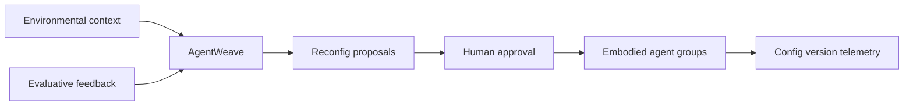

# AgentWeave

**Source:** `ai-in-iot/1812.06791v1/`
**Domain:** `ai-iot`
**One-liner:** A configuration studio for embodied IoT agent fleets that captures variability in sensors/actuators/behaviors, learns from evaluative feedback, and reconfigures agent groups when environmental context shifts.
**Wedge:** Smart-city and building teams deploying agent-operated devices (street lights, traffic signals, mobile robots) that today hard-code behaviors and re-engineer when context changes.
**Positioning:** Variability-first agent ops for IoT. Traditional agent processes lack mechanisms for IoT component variability; AgentWeave productizes the paper’s triad — feature/variability model of embodied agents, feedback-evaluative ML, and context-aware group reconfiguration — with human-in-the-loop control.

## Market research synthesis

### Thesis from source

IoT is tightly coupled to robotics and machine learning in practice: agents are a natural model for distributed device control (traffic lights, driverless vehicles, street lights). Embodied agents are physically situated — they sense, act, and interact with humans and the environment. Specifying all beneficial collective behaviors at design-time is hard; evolving neural approaches help agents adapt, but IoT systems also have high numbers of variation points that traditional agent development does not manage well.

The paper argues for an explicit variability model of IoT embodied agents, feedback-evaluative machine learning to improve configurations, and reconfiguration of agent groups according to environmental context — a human-in-the-loop, self-configurable system. The commercial product is not “another robot brain,” but an ops layer that makes agent fleets configurable across hardware bodies and missions without rewriting each deployment from scratch.

### Buyer & economic model

- **Primary buyer:** Smart-city program lead or building robotics/automation architect; secondary: systems integrators delivering multi-agent IoT solutions.
- **Users:** agent developers, city OT operators, ML evaluators, safety reviewers, integration engineers.
- **Budget owner / value metric:** digital city / facilities automation budget. Value metrics: time-to-reconfigure after context change, variation points managed without custom forks, incident rate from misconfiguration, human approval latency.
- **Competing status quo:** one-off agent codebases per site; static rule engines; pure neuroevolution without variability governance; manual truck rolls to reflash devices.

### Domain constraints

- **Regulatory / trust / safety:** traffic and public-realm actuators are safety-critical; reconfiguration needs staged rollout and kill switches.
- **Data sensitivity:** cameras/mics on embodied agents; evaluative feedback may include citizen complaints.
- **Change-management realities:** cities will not grant full autonomy; human approval gates are a feature, not a bug.

## Business requirements

- BR-1: Operators must model embodied agent variability (sensors, actuators, behaviors, constraints) as first-class configuration, not buried in code.
- BR-2: Evaluative feedback (human scores, KPI outcomes) must update recommended configurations with explainable diffs.
- BR-3: Environmental context changes must be able to trigger proposed group reconfigurations subject to approval policy.
- BR-4: Safety-critical actuator classes require dual control: proposed config + human sign-off before activation.
- BR-5: Rollouts must support canary cohorts of agents with automatic halt on safety KPI breach.
- BR-6: Every live agent must report which variability configuration version it is running.
- BR-7: Audit trails must show who approved which reconfiguration and why (feedback evidence).
- BR-8: Multi-site tenants isolate feature models and learning; no silent cross-city transfer without opt-in.
- BR-9: Developers must export/import variability models for reuse across similar missions (e.g., street-light fleets).
- BR-10: Commercial packaging prices by managed agents and approved reconfiguration events.
- BR-11: Kill-switch must revert a group to last-known-safe configuration within a published time bound.
- BR-12: Human-in-the-loop overrides always win over automated suggestions for public-safety contexts.

## User stories

Canonical user stories live in sibling [USER_STORIES.md](USER_STORIES.md).

## System design

### Overview

AgentWeave maintains variability models for embodied agents, collects evaluative feedback and environmental context, proposes group reconfigurations via feedback-evaluative learning, gates activation with human approval and canaries, and monitors live config versions with kill-switch rollback.

### Actors & boundaries

- **Actors:** operators, developers, safety reviewers, agents/devices, citizens (feedback), integrator admins.
- **Trust boundary:** safety actuation commands leave only through approved config versions; learning proposals are not self-executing in safety classes.
- **Human-in-the-loop points:** config approval; canary promotion; kill-switch; variability model edits.

### Core capabilities

1. **Variability / feature modeling**
2. **Agent and group inventory**
3. **Context sensing intake**
4. **Evaluative feedback capture**
5. **Reconfiguration proposal engine**
6. **Approval, canary, and kill-switch**
7. **Live config telemetry**
8. **Audit and export**

### Conceptual data

- **Primary entities:** VariabilityModel, AgentBody, BehaviorFeature, AgentInstance, AgentGroup, ContextSnapshot, FeedbackEvent, ReconfigProposal, ConfigVersion, ApprovalRecord.
- **Critical events:** context shifted, proposal created, approved, canary failed, kill-switch fired, feedback recorded.
- **Retention / audit needs:** approvals and config versions retained for public accountability windows.

### Integrations (conceptual)

- **Systems of record:** city asset management, traffic management centers, building BMS, robot fleet managers.
- **Upstream signals:** environmental sensors, traffic KPIs, citizen 311 tickets, agent telemetry.
- **Downstream actions:** config push to agents, work orders, public incident logs.

### High-level architecture

### Success metrics

- **Leading:** proposals auto-generated vs manually authored; approval cycle time; canary pass rate.
- **Lagging:** misconfiguration incidents; time-to-adapt after context shift; reuse of variability models across sites.

## OpenAPI skeleton

Canonical HTTP surface lives in sibling `openapi.yaml`. Summarize here:

- **Base path:** `/v1/...`
- **Auth:** API key and/or Bearer JWT (operator)
- **Resource groups:** Models, Agents, Groups, Feedback, Proposals, Approvals
