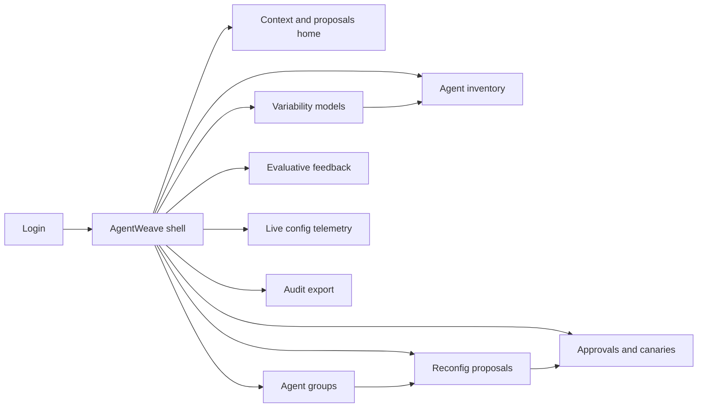
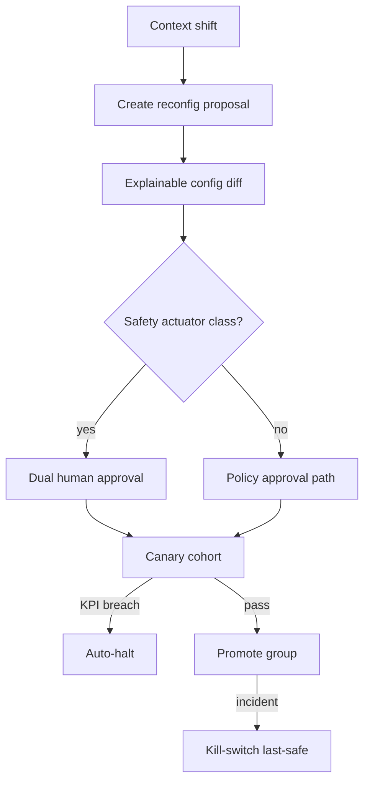

# AgentWeave — Web app

**Product:** [PRODUCT.md](./PRODUCT.md)
**Primary surface:** Embodied agent fleet configuration studio (variability → feedback → gated reconfig)
**Secondary surfaces:** Safety approval inbox; public canary/kill-switch attestation; integrator model export exchange
**Design thesis:** AgentWeave is a loom for embodied agents — sensors, actuators, and behaviors are variation threads you reweave when the city context shifts, never a silent brain rewrite. Visual language is dusk asphalt with weave-copper proposal highlights and safety-teal approved strands on a deep civic-night ground: canaries glow narrowly; kill-switch cools a district back to last-safe in one motion. The brand wordmark sits as a quiet weave mark on every approval screen so operators know whose public-realm actuators they are signing for.

## UX research synthesis

### Category peers (best-in-class)

- **FeatureOS / LaunchDarkly (flag governance):** Variation points, canaries, kill switches. Steal: config version telemetry and halt-on-KPI-breach; reject treating traffic actuators like marketing flags without dual control.
- **NVIDIA Isaac / ROS fleet tools:** Embodied agent inventory and skill/behavior graphs. Steal: body + behavior as first-class; reject burying hardware SKUs in code forks.
- **City traffic management (TransCore / Yunex-class) ops:** Staged signal timing changes with human approval. Steal: dual control and human override always wins for public safety; reject full autonomy as default.
- **IFTTT / Node-RED (integrators) + enterprise change mgmt:** Reuse templates across sites with local overrides. Steal: export/import variability models with tenant isolation; reject silent cross-city learning transfer.

### Patterns to adopt / reject

- **Adopt:** Variability model as home spine; evaluative feedback with explainable config diffs; context-triggered proposals under approval; dual control for safety actuators; canary cohorts; live config version on every agent; kill-switch to last-safe; HITL override supremacy; site isolation.
- **Reject:** One-off agent codebase browser; auto-apply ML suggestions to traffic signals; district-wide big-bang rollout; purple “autonomous city” dashboards; citizen feedback ignored as noise.

### Trust, density, and workflow constraints from PRODUCT.md

Public-realm actuators are safety-critical (BR-4, BR-12): proposals are not self-executing. Context shifts need gated reconfig (BR-3) with canaries and kill-switch time bounds (BR-5, BR-11). Variability must be operable without forks (BR-1, BR-9). Feedback grounds learning with audit who/why (BR-2, BR-7). Multi-site isolation is mandatory (BR-8). Live agents report config version (BR-6).

## Information architecture

### Nav model

### Roles → default home

| Role | Default home | Why |
|------|--------------|-----|
| Smart-city operator | Context and proposals home | Weather/traffic reweave (BR-3) |
| Agent developer | Variability models | Bodies/behaviors without forks (BR-1) |
| Safety reviewer | Approvals inbox | Dual control (BR-4, BR-12) |
| Systems integrator | Model export/import | Reuse across municipalities (BR-8, BR-9) |
| Complaints desk | Evaluative feedback | Lived experience into loop |

### Cross-links to OpenAPI resources

| Nav area | OpenAPI tags / resources |
|----------|---------------------------|
| Variability models | Models |
| Agent inventory, config telemetry | Agents |
| Agent groups, context | Groups |
| Evaluative feedback | Feedback |
| Reconfig proposals, canary, kill-switch | Proposals |
| Approvals | Approvals |

## Screen inventory

### Context and proposals home

- **Purpose:** Answer “what context shifted and which group reweaves are waiting?” in one composition.
- **Entry:** Operator default.
- **Layout regions:** Brand + site; active context snapshots; open proposals; canary health; kill-switch ready; packaging (agents × reconfigs).
- **Primary actions:** Open proposal; trigger kill-switch; open group map.
- **Empty / loading / error:** Empty = register first variability model + group.
- **BR / story ties:** BR-3, BR-10, BR-11; operator stories.

### Variability model studio

- **Purpose:** Model sensors, actuators, behaviors, constraints as first-class configuration.
- **Entry:** VarModels nav; developer default.
- **Layout regions:** Feature tree; body SKUs; behavior features; constraints; export/import.
- **Primary actions:** Edit features; bind body; export model; clone with local overrides.
- **Empty / loading / error:** Missing actuator constraints block safety-class publish.
- **BR / story ties:** BR-1, BR-9; developer stories.

### Agent inventory

- **Purpose:** Embodied instances with live variability configuration version.
- **Entry:** Agents nav.
- **Layout regions:** Agent table (body, group, config version, health); detail with sensors/actuators.
- **Primary actions:** Enroll agent; move group; open telemetry.
- **Empty / loading / error:** Unknown config version = coral drift.
- **BR / story ties:** BR-6.

### Agent groups and context

- **Purpose:** Group agents for missions; ingest environmental context that may trigger proposals.
- **Entry:** Groups nav.
- **Layout regions:** Group map; context stream; policy for auto-propose; site isolation badge.
- **Primary actions:** Create group; set context triggers; forbid cross-site learning.
- **Empty / loading / error:** Cross-site transfer attempt hard-blocked without opt-in.
- **BR / story ties:** BR-3, BR-8.

### Evaluative feedback

- **Purpose:** Human scores, KPI outcomes, citizen complaints attached to config versions with explainable diffs.
- **Entry:** Feedback nav; complaints desk.
- **Layout regions:** Feedback feed; linked config; KPI delta; diff preview feeding proposals.
- **Primary actions:** Record score; attach 311; open resulting proposal.
- **Empty / loading / error:** Empty = invite field evaluation campaign.
- **BR / story ties:** BR-2; developer and complaints stories.

### Reconfiguration proposals

- **Purpose:** Feedback-evaluative ML suggestions as diffs — not silent firmware rewrite.
- **Entry:** Proposals nav; home deep link.
- **Layout regions:** Proposal list; explainable diff; evidence panel; safety class; submit for approval.
- **Primary actions:** Edit proposal; request approval; reject; simulate.
- **Empty / loading / error:** Safety class cannot auto-activate.
- **BR / story ties:** BR-2, BR-3, BR-4.

### Approvals, canary, kill-switch

- **Purpose:** Dual control, canary cohorts, halt on safety KPI breach, revert to last-safe.
- **Entry:** Approvals nav; safety default.
- **Layout regions:** Inbox; dual-approver panes; canary cohort map; KPI halt rules; kill-switch with time bound.
- **Primary actions:** Approve; start canary; promote; halt; kill-switch.
- **Empty / loading / error:** Single approval insufficient for safety actuators; canary breach auto-halts.
- **BR / story ties:** BR-4, BR-5, BR-11, BR-12; safety reviewer stories.

### Live config telemetry

- **Purpose:** Every live agent reports running configuration version for drift detection.
- **Entry:** Telemetry nav.
- **Layout regions:** Version distribution; drift list; last-safe pins; rollout progress.
- **Primary actions:** Quarantine drifted agent; align to approved; export attestation.
- **Empty / loading / error:** Drift coral until resolved.
- **BR / story ties:** BR-6.

### Audit export

- **Purpose:** Who approved which reconfig and why (feedback evidence) for public accountability.
- **Entry:** Audit nav.
- **Layout regions:** Approval timeline; evidence pack; site scope; export.
- **Primary actions:** Export PDF/CSV; share attestation.
- **Empty / loading / error:** Missing evidence blocks “complete” audit pack.
- **BR / story ties:** BR-7.

## Key flows

1. **Context-triggered reweave** — context shift → proposal with explainable diff → dual approve (if safety) → canary → promote or halt; kill-switch to last-safe on incident.

2. **Feedback into learning** — citizen/KPI feedback → attach to config version → update recommendations (BR-2).

3. **Variability reuse** — export street-light model → import to new municipality with overrides → no silent learning leak (BR-8, BR-9).

4. **HITL override** — operator force last-safe or manual config → always wins over automation in public-safety (BR-12).

5. **Drift repair** — telemetry shows wrong version → quarantine → realign to approved (BR-6).

## Design system

### Tokens (CSS variables)

- `--color-ink: #EDE8E2` — text on civic-night
- `--color-civic-950: #0E0C0A` — app ground
- `--color-civic-900: #1A1612` — panels
- `--color-civic-700: #3A322C` — rules
- `--color-weave: #C47A3A` — proposal / copper accent
- `--color-approved: #3D8B7A` — dual-approved / canary pass
- `--color-amber: #D4A017` — canary running / provisional
- `--color-coral: #E05A4F` — halt / kill / drift
- `--color-steel: #9A8F84` — secondary
- `--font-display: "Fraunces", serif` — group and proposal titles
- `--font-body: "IBM Plex Sans", sans-serif`
- `--font-mono: "IBM Plex Mono", monospace` — config versions, agent ids
- `--space-1`…`--space-8`: 4px scale
- `--radius-sm: 4px`; `--radius-md: 8px`
- `--motion-weave: 260ms ease-out` — diff apply preview
- `--motion-canary: 300ms ease-in-out` — canary cohort pulse
- `--motion-kill: 200ms linear` — kill-switch revert flash
- Atmosphere: dusk asphalt grain, woven line underlay; civic-night; no purple autonomous-city glow.

### Typography & brand

- Display serif for group names and proposal headlines; mono for config versions.
- Brand weave mark on approval views; login: brand + “Reweave agents when the city shifts” + one CTA.

### Do / don’t

- **Do:** Variation points first; explainable diffs; dual control; canaries; kill-switch time bound; HITL wins; site isolation.
- **Don’t:** Auto-live traffic changes; district big-bang; silent cross-city transfer; purple autonomy panels; hide who approved.

### Accessibility & domain trust cues

- Proposal/approved/halt states use icon + text.
- Live regions for canary halt and kill-switch.
- Focus: proposal → diff → approve → canary → promote.
- Kill-switch attestation machine-readable for public logs.

## Component patterns

- **VariabilityFeatureTree** — sensors/actuators/behaviors/constraints.
- **ExplainableConfigDiff** — before/after with feedback evidence.
- **ContextTriggerChip** — environmental shift → proposal.
- **DualApprovalInbox** — safety-class two-approver gate.
- **CanaryCohortMap** — narrow rollout with KPI halt.
- **KillSwitchLastSafe** — timed revert control.
- **ConfigVersionTelemetry** — live agent version distribution.
- **SiteIsolationBadge** — no silent cross-city learning.

## Out of scope for v1 web

- Robot motion-planning IDE; full traffic signal hardware controller UI; citizen social network; autonomous self-executing safety changes; cross-city model marketplace without contracts; headset teleop client.
